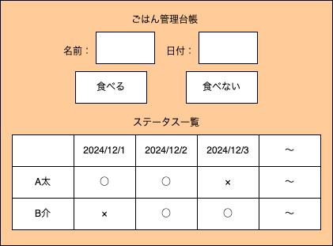

# cc-fullstuck-project

## デザイン

### 背景

- 今住んでいる寮でご飯の食べる/食べないが紙の台帳ベースの管理となっている。
  - 台帳は寮の食堂にしか置かれていないので、寮生はわざわざ食堂に出向き台帳に記載/確認する必要がある。
- 台帳をサーバ上で管理し、web アプリケーションを使ってインターネット経由でどこからでもアクセス・変更できるようにしたい。

### 要件

- web アプリケーション経由で台帳にアクセス・変更ができること。
  - 台帳の内容を確認できること。
  - 台帳の内容を変更できること。

### 実現方式

- web 画面上に以下の要素を設ける。
  - ユーザの名前と食べる/食べないのステータスを更新する日付を入力するフォーム。
  - 食べる/食べないのステータスを更新するボタン。
  - 台帳 DB の内容を表示するステータス一覧。

### フロント画面概要

